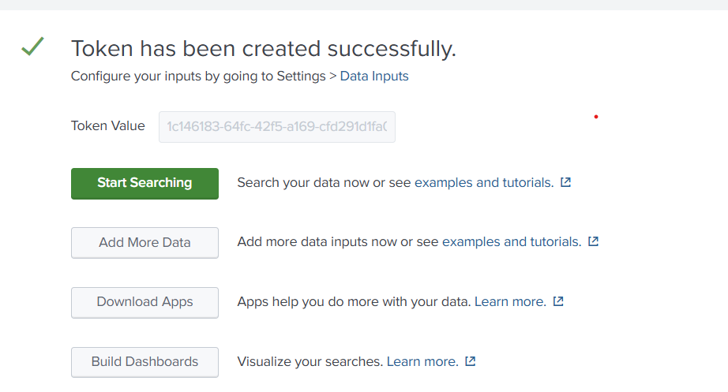
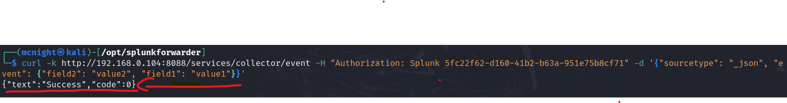
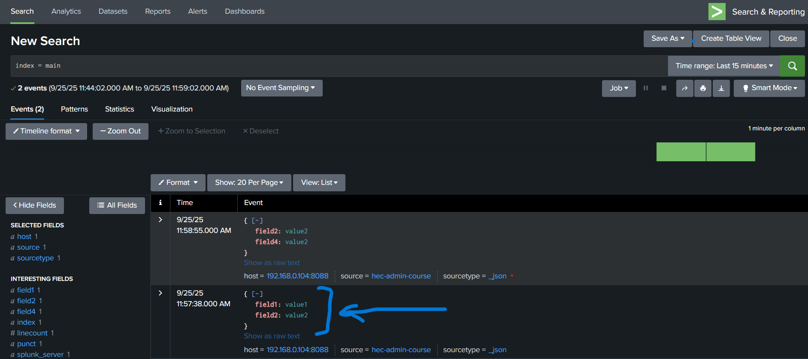

# Splunk HTTP Event Collector (HEC) Setup and Testing Guide

## Overview
This guide demonstrates how to configure and test Splunk's HTTP Event Collector (HEC) to send JSON events directly to Splunk via HTTP/HTTPS.

## Prerequisites
Splunk Enterprise installed and running

Access to Splunk Web interface

Network connectivity to Splunk instance (port 8088)

### Step 1: Understanding HTTP Event Collector

The HTTP Event Collector allows applications to send data directly to Splunk without requiring a forwarder. Key features:

- Token-based authentication

- Direct HTTP/HTTPS event submission

- No Splunk forwarder required

- Supports JSON and raw event formats

### Step 2: Enable HTTP Event Collector

1. Navigate to Settings → Data Inputs → HTTP Event Collector

2. Click Global Settings

3. Ensure HEC is Enabled

4. Configure settings:

  - Default Source Type: _json

  - Default Index: main

  - HTTP Port: 8088

  - Enable SSL: Optional (disabled for testing)

### Step 3: Create HEC Token

1. Click New Token

2. Configure token settings:

  - Name: admin-course

  - Source name override: Optional

  - Description: Optional


3. Select allowed indexes (typically main)
4. Set default index for the token

### Step 4: Copy Token Value

After creation, copy the generated token:

```bash
EX: 1c146183-64fc-42f5-a169-cfd291d1fa06
```
`Important`: Save this token securely as it cannot be retrieved again.

### Step 5: Verify Token in List

Confirm the token appears in the HEC tokens list with correct configuration.




### Step 6: Test HEC with curl

Use the following command to test HEC connectivity:

```bash
curl -k http://192.168.0.104:8088/services/collector/event \
  -H "Authorization: Splunk 1c146183-64fc-42f5-a169-cfd291d1fa06" \
  -d '{"sourcetype": "_json", "event": {"field2": "value2", "field1": "value1"}}'
```



### Step 7: Verify Data in Splunk




1. Open Splunk Search interface

2. Set time range to Last 15 minutes

3. Search: index=main

4. Verify events appear with fields:

    - field1: value1

    - field2: value2

    - host: 192.168.0.104:8088

    - sourcetype: _json


## Conclusion
Successfully configured HTTP Event Collector to accept JSON events via HTTP. The setup allows applications to send data directly to Splunk without intermediate forwarders, simplifying data ingestion for custom applications and scripts.

Y.