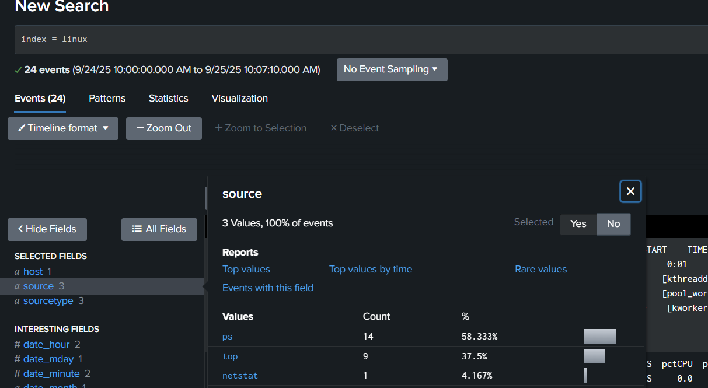
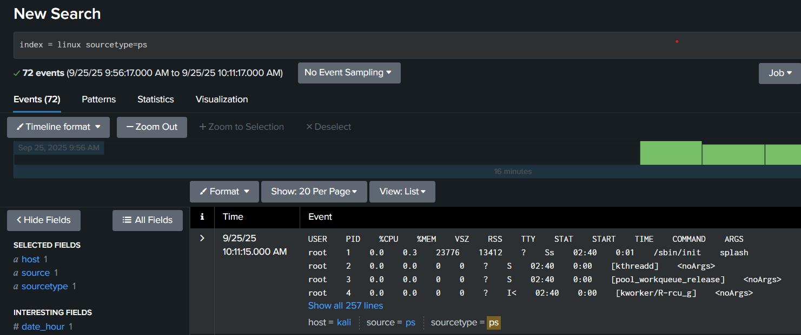

# Monitoring System Metrics with Splunk: Configuring Scripted Inputs and Search Head Visualization

## Overview


This demo demonstrates how to configure Splunk Universal Forwarder to execute scripts at regular intervals and monitor the output through Splunk's search head interface. The setup collects system performance data using shell scripts and visualizes it in real-time.

## file Structure
```bash
/opt/splunkforwarder/etc/apps/UF_base_inputs/
├── bin/
│   ├── common.sh
│   ├── netstat.sh
│   ├── ps.sh
│   └── top.sh
├── local/
│   ├── inputs.conf
│   └── outputs.conf
└── metadata/
    └── local.meta
```
## Configuration Details

### Inputs Configuration (local/inputs.conf)
The configuration file defines three scripted inputs with specific intervals:
```ini
[script://./bin/ps.sh]
interval = 30
sourcetype = ps
source = ps
disabled = 0
index = linux

[script://./bin/top.sh]
interval = 60
sourcetype = top
source = top
disabled = 0
index = linux

[script://./bin/netstat.sh]
interval = 60
sourcetype = netstat
source = netstat
disabled = 0
index = linux
```
### Data Collection Specifications

- ps.sh: Runs every 30 seconds, collecting process information

- top.sh: Runs every 60 seconds, gathering system resource usage

- netstat.sh: Runs every 60 seconds, monitoring network statistics

## Search Head Monitoring Results

### Event Distribution Analysis
During the monitoring period (9/24/25 10:00:00 AM to 9/25/25 10:07:10 AM), Splunk collected:

- 24 total events across all sourcetypes

- Event distribution by source:

- ps: 14 events (58.33%)

- top: 9 events (37.5%)

- netstat: 1 event (4.167%)



## Detailed Process Monitoring
The ps sourcetype data reveals comprehensive system process information:



### Sample Process Data Collected:

- System daemons (kthreadd, pool_workqueue_release)

- Worker processes (kworker)

- System initialization (/sbin/init)

- Resource usage metrics for each process


## Key Features Demonstrated
### 1. Flexible Interval Configuration
- Different scripts can run at varying frequencies based on data criticality

- ps data collected more frequently (30s) than network stats (60s)

### 2. Structured Data Categorization
- Each script assigned unique sourcetype for easy filtering

- Consistent field extraction for analytical queries

### 3. Real-time Search Capabilities
- Timeline-based event navigation

- Field statistics and value distribution analysis

- Zoom and selection tools for detailed investigation

### 4. Comprehensive Field Management
- Selected fields for quick access

- Interesting fields automatically identified by Splunk

- Time-based field aggregation (date_hour, date_minute)


## Visualization Capabilities
- Splunk's interface provides multiple analytical views:

- Patterns: Identify trends and anomalies

- Statistics: Quantitative data analysis

- Visualization: Graphical representation of metrics

## Benefits Achieved
- Proactive Monitoring: Continuous system health assessment

- Historical Analysis: Time-based data correlation

- Troubleshooting: Rapid identification of performance issues

- Customizable Alerts: Configurable thresholds for critical metrics

## Conclusion
This implementation successfully demonstrates Splunk's capability to monitor system metrics through scripted inputs. The configuration allows for scalable data collection with minimal overhead, while the search head provides powerful tools for real-time analysis and historical trending. This pattern can be extended to monitor various system and application metrics across enterprise environments.

Y.