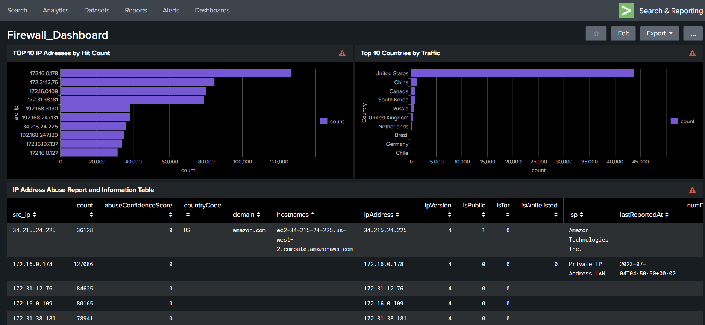

# Firewall Dashboard: Security Visibility and Threat Intelligence



This document showcases a comprehensive Security Operations Center (SOC) dashboard focused on firewall activity. This dashboard is crucial for real-time monitoring, rapid incident response, and proactive threat intelligence gathering by providing a clear visual representation of network traffic patterns, high-volume contributors, and potential malicious IP addresses.

The dashboard uses data from the botsv3 index, which contains critical firewall logs detailing source and           
destination IP addresses and timestamps.

## The Importance of this Dashboard
1. Real-Time Situational Awareness: Provides immediate visibility into what is happening on the network, enabling   security analysts to quickly spot anomalies or spikes in traffic.

2. Threat Hunting and Prioritization: By listing the top IPs by hit count and integrating abuse reports, analysts can immediately prioritize investigations into the most suspicious or aggressive sources.

3. Geographic Risk Assessment: The "Top 10 Countries by Traffic" panel helps identify external geographic risk factors and can guide geo-blocking or regional access policy decisions.

4. Efficiency in Incident Response: Consolidating critical information—traffic volume, geolocation, and threat reputation—into a single view significantly reduces the time required for initial triage and investigation.

## Dashboard Components and SPL Details
1. TOP 10 IP Addresses by Hit Count
This panel provides immediate visibility into which source IP addresses are generating the highest volume of traffic directed towards the network. High counts often indicate scanners, brute-force attempts, or high-volume automated access (like bots or CDN health checks).


SPL:
```bash
index="botsv3"
| table _time src_ip dest_ip
| stats count by src_ip
| sort - count
| head 10
```

2. Top 10 Countries by Traffic
This visualization maps traffic volume to geographical origin, which is vital for understanding the global attack surface or identifying unexpected traffic sources.


SPL:
```bash
index="botsv3"
| table _time src_ip dest_ip
| iplocation src_ip
| stats count by Country
| sort - count
| head 10
```

3. IP Address Abuse Report and Information Table
This is the most critical threat intelligence component. It takes the top high-volume source IP addresses, enriches them with threat intelligence data (specifically the abuseipdbcheck), and presents details like the Abuse Confidence Score, domain, and IP version.

[*] NOTE: to access the services of reputation database you need to download the splunk app "abuseipdb" and create a free account so you can generate the API key to gain access to the database.

SPL:
```bash
index="botsv3"
| table _time src_ip dest_ip
| iplocation src_ip
| stats count by src_ip
| sort - count
| head 10
| abuseipdbcheck ip=src_ip
```

Y.