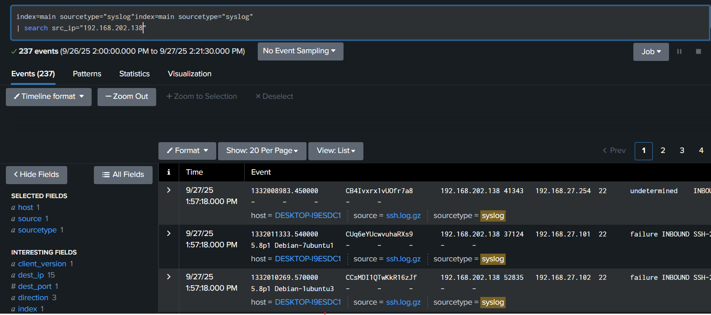

# Analyzing SSH Log Files Using Splunk SIEM

## Introduction
SSH (Secure Shell) log files contain valuable information about remote access to servers, including login attempts, commands executed, and session details. Analyzing SSH logs using Splunk SIEM enables security professionals to monitor access to critical systems, detect anomalies, and identify potential security threats.

## Project Overview
In this demo, we will upload sample SSH log files to Splunk SIEM and perform various analyses to gain insights into SSH activity within the network.

## Prerequisites
Before starting the project, ensure the following:
- Splunk instance is installed and configured.
- SSH log data sources are configured to forward logs to Splunk.

## Steps to Upload Sample SSH Log Files to Splunk SIEM

### 1. Prepare Sample SSH Log Files
- Obtain sample [SSH log files](https://www.secrepo.com/maccdc2012/ssh.log.gz) in a suitable format (e.g., text files).
- Ensure the log files contain relevant SSH events, including timestamps, source IP addresses, usernames, actions (login, logout), etc.
- Save the sample log files in a directory accessible by the Splunk instance.

### 2. Upload Log Files to Splunk
- Log in to the Splunk web interface.
- Navigate to **Settings** > **Add Data**.
- Select **Upload** as the data input method.

### 3. Choose File
- Click on **Select File** and choose the sample SSH log file you prepared earlier.

### 4. Set Source Type
- In the **Set Source Type** section, specify the source type for the uploaded log file.
- Choose the appropriate source type for SSH logs (e.g., `syslog` or a custom source type if applicable).

### 5. Review Settings
- Review other settings such as index, host, and sourcetype.
- Ensure the settings are configured correctly to match the sample SSH log file.

### 6. Click Upload
- Once all settings are configured, click on the **Review** button.
- Review the settings one final time to ensure accuracy.
- Click **Submit** to upload the sample SSH log file to Splunk.

### 7. Verify Upload
- After uploading, navigate to the search bar in the Splunk interface.
- Run a search query to verify that the uploaded SSH events are visible.


## Steps to Analyze SSH Log Files in Splunk SIEM


### 1. Search for SSH Events
- Open Splunk interface and navigate to the search bar.
- Enter the following search query to retrieve SSH events:
```
index=<your_ssh_index> sourcetype=<your_ssh_sourcetype>
```

### 2. Extract Relevant Fields
- Identify key fields in SSH logs such as timestamps, source IP addresses, usernames, actions, etc.
- Use Splunk's field extraction capabilities or regular expressions to extract these fields for better analysis.
- Example extraction command:
```bash
^(?<timestamp>\d+\.\d+)\t(?<session_id>\w+)\t(?<src_ip>\d+\.\d+\.\d+\.\d+)\t(?<src_port>\d+)\t(?<dest_ip>\d+\.\d+\.\d+\.\d+)\t(?<dest_port>\d+)\t(?<direction>\w+)\t(?<client_version>[^\t]*)\t(?<server_version>[^\t]*)
```


### 3. Analyze SSH Activity Patterns


- Identify top users or source IP addresses accessing the SSH server:
```
index=<your_ssh_index> sourcetype=<your_ssh_sourcetype>
| stats count by src_ip
```


- Analyze successful vs. failed SSH login attempts:
```
index=<your_ssh_index> sourcetype=<your_ssh_sourcetype>
| stats count by direction
```


### 4. Detect Anomalies
- Look for unusual patterns in SSH activity (e.g., sudden spikes in login attempts):
```
index=<your_ssh_index> sourcetype=<your_ssh_sourcetype>
| timechart span=1h count as hourly_connections
```


- Investigate SSH sessions from unusual or suspicious source IP addresses:
```
index=<your_ssh_index> sourcetype=<your_ssh_sourcetype>
| search src_ip="suspicious_ip"
```



## Conclusion
Analyzing SSH log files using Splunk SIEM provides valuable insights into remote access to servers within a network. By monitoring SSH events, detecting anomalies, and correlating with other logs, organizations can enhance their security posture and protect against unauthorized access and potential security threats.

Y.


