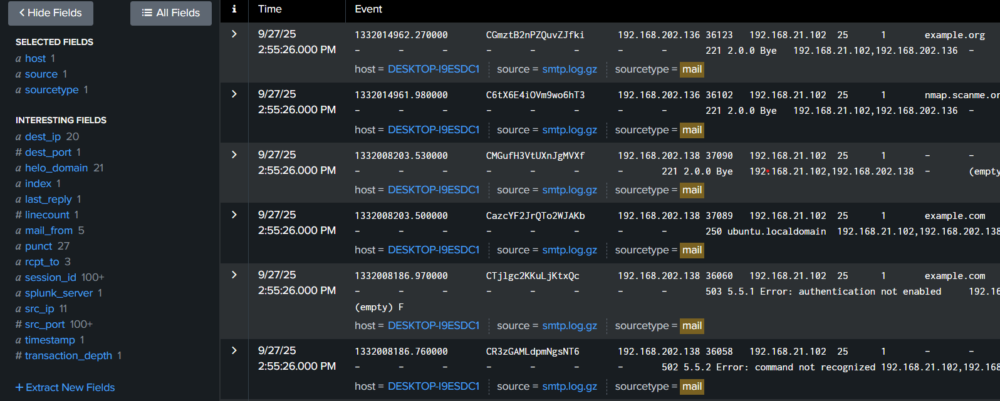

# Analyzing SMTP Log Files Using Splunk SIEM

## Introduction
SMTP (Simple Mail Transfer Protocol) log files contain valuable information about email communication, including sender and recipient addresses, timestamps, email subjects, and more. Analyzing SMTP logs using Splunk SIEM enables security professionals to monitor email traffic, detect anomalies, and identify potential security threats.

## Demo Overview
In this demo, we will upload sample SMTP log files to Splunk SIEM and perform various analyses to gain insights into email communication within the network.

## Prerequisites
Before starting the demo, ensure the following:
- Splunk instance is installed and configured.
- SMTP log data sources are configured to forward logs to Splunk.

## Steps to Upload Sample SMTP Log Files to Splunk SIEM

### 1. Prepare Sample SMTP Log Files
- Obtain sample [SMTP log file](https://www.secrepo.com/maccdc2012/smtp.log.gz) in a suitable format (e.g., text files).
- Ensure the log files contain relevant SMTP events, including timestamps, sender and recipient addresses, email subjects, etc.
- Save the sample log files in a directory accessible by the Splunk instance.

### 2. Upload Log Files to Splunk
- Log in to the Splunk web interface.
- Navigate to **Settings** > **Add Data**.
- Select **Upload** as the data input method.

### 3. Choose File
- Click on **Select File** and choose the sample SMTP log file you prepared earlier.

### 4. Set Source Type
- In the **Set Source Type** section, specify the source type for the uploaded log file.
- Choose the appropriate source type for SMTP logs (e.g., `mail` or a custom source type if applicable).

### 5. Review Settings
- Review other settings such as index, host, and sourcetype.
- Ensure the settings are configured correctly to match the sample SMTP log file.

### 6. Click Upload
- Once all settings are configured, click on the **Review** button.
- Review the settings one final time to ensure accuracy.
- Click **Submit** to upload the sample SMTP log file to Splunk.

### 7. Verify Upload
- After uploading, navigate to the search bar in the Splunk interface.
- Run a search query to verify that the uploaded SMTP events are visible.

## Steps to Analyze SMTP Log Files in Splunk SIEM


### 1. Search for SMTP Events
- Open Splunk interface and navigate to the search bar.
- Enter the following search query to retrieve SMTP events
```
index=<your_smtp_index> sourcetype=<your_smtp_sourcetype>
```

### 2. Extract Relevant Fields
- Identify key fields in SMTP logs such as timestamps, sender and recipient addresses, email subjects, etc.
- Use Splunk's field extraction capabilities or regular expressions to extract these fields for better analysis.
- Example extraction command
```
^(?<timestamp>\d+\.\d+)\t(?<session_id>\w+)\t(?<src_ip>\d+\.\d+\.\d+\.\d+)\t(?<src_port>\d+)\t(?<dest_ip>\d+\.\d+\.\d+\.\d+)\t(?<dest_port>\d+)\t(?<transaction_depth>\d+)\t(?<helo_domain>[^\t]*)\t(?<mail_from>[^\t]*)\t(?<rcpt_to>[^\t]*)\t(?<last_reply>[^\t]*)

```



### 3. Analyze Email Traffic Patterns
- Determine the distribution of email senders:
```
index=<your_smtp_index> sourcetype=<your_smtp_sourcetype>
| top limit=10 sender_address
```
- Identify top recipient addresses:
```
index=<your_smtp_index> sourcetype=<your_smtp_sourcetype>
| top limit=10 recipient_address
```

### 4. Detect Anomalies
- Look for unusual patterns in email traffic:
```
index=<your_smtp_index> sourcetype=<your_smtp_sourcetype>
| timechart span=1h count by _time
```

- Investigate emails with unusual attachment types or sizes:
```
index=<your_smtp_index> sourcetype=<your_smtp_sourcetype>
| search attachment_type="unusual_type" OR attachment_size > 1000000
```

### 5. Monitor User Behavior
- Monitor user behavior related to email communication:
```
index=<your_smtp_index> sourcetype=<your_smtp_sourcetype>
| stats count by user
```
- Identify users with multiple failed login attempts or unauthorized access attempts to email accounts:
```
index=<your_smtp_index> sourcetype=<your_smtp_sourcetype>
| search action="login" status="failed"
| stats count by user
```
- Analyze email activity patterns and deviations from normal behavior:
```
index=<your_smtp_index> sourcetype=<your_smtp_sourcetype>
| timechart span=1d count by user
```


## Conclusion
Analyzing SMTP log files with Splunk SIEM enhances network security by monitoring email traffic, detecting anomalies, and correlating data for threat detection. By leveraging Splunk's capabilities, organizations can proactively identify and respond to email-based threats, ensuring the integrity and confidentiality of their communications.

Y.

