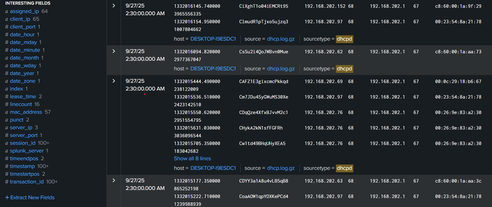

# Analyzing DHCP Log Files Using Splunk SIEM

## Introduction
DHCP (Dynamic Host Configuration Protocol) log files contain valuable information about IP address assignments, lease durations, client requests, and server responses. Analyzing DHCP logs using Splunk SIEM enables network administrators to monitor IP address usage, detect anomalies, and troubleshoot network issues effectively.

## Lab Overview
In this lab, we will upload sample DHCP log files to Splunk SIEM and perform various analyses to gain insights into IP address assignment within the network.

## Prerequisites
Before starting the lab, ensure the following:
- Splunk instance is installed and configured.
- DHCP log data sources are configured to forward logs to Splunk.

## Steps to Upload Sample DHCP Log Files to Splunk SIEM

### 1. Prepare Sample DHCP Log Files
- Obtain sample [DHCP log files](https://www.secrepo.com/maccdc2012/dhcp.log.gz) in a suitable format.
- Ensure the log files contain relevant DHCP events, including timestamps, IP address assignments, lease durations, client identifiers, etc.
- Save the sample log files in a directory accessible by the Splunk instance.

### 2. Upload Log Files to Splunk
- Log in to the Splunk web interface.
- Navigate to **Settings** > **Add Data**.
- Select **Upload** as the data input method.

### 3. Choose File
- Click on **Select File** and choose the sample DHCP log file you prepared earlier.

### 4. Set Source Type
- In the **Set Source Type** section, specify the source type for the uploaded log file.
- Choose the appropriate source type for DHCP logs (e.g., `dhcpd` or a custom source type if applicable).

### 5. Review Settings
- Review other settings such as index, host, and sourcetype.
- Ensure the settings are configured correctly to match the sample DHCP log file.

### 6. Click Upload
- Once all settings are configured, click on the **Review** button.
- Review the settings one final time to ensure accuracy.
- Click **Submit** to upload the sample DHCP log file to Splunk.

### 7. Verify Upload
- After uploading, navigate to the search bar in the Splunk interface.
- Run a search query to verify that the uploaded DHCP events are visible.

## Steps to Analyze DHCP Log Files in Splunk SIEM


### 1. 1. Search for DHCP Events
- Open Splunk interface and navigate to the search bar.
- Enter the following search query to retrieve DHCP events:
```
index=<your_dhcp_index> sourcetype=<your_dhcp_sourcetype>
```

### 2. Extract Relevant Fields
- Identify key fields in DHCP logs such as timestamps, IP addresses, lease durations, client identifiers, etc.
- Use Splunk's field extraction capabilities or regular expressions to extract these fields for better analysis.
- Example extraction command
```
^(?<timestamp>\d+\.\d+)\t(?<session_id>\w+)\t(?<client_ip>\d+\.\d+\.\d+\.\d+)\t(?<client_port>\d+)\t(?<server_ip>\d+\.\d+\.\d+\.\d+)\t(?<server_port>\d+)\t(?<mac_address>(?:[a-fA-F0-9]{2}:){5}[a-fA-F0-9]{2})\t(?<assigned_ip>\d+\.\d+\.\d+\.\d+)\t(?<lease_time>\d+\.\d+)\t(?<transaction_id>\d+)
```



### 3. Analyze Email Traffic Patterns
- Determine the distribution of IP address assignments:
```
index=<your_dhcp_index> sourcetype=<your_dhcp_sourcetype>
| stats count by leased_ip
```
- Identify top IP addresses leased by the DHCP server:
```
index=<your_dhcp_index> sourcetype=<your_dhcp_sourcetype>
| top limit=10 leased_ip
```

### 4. Detect Anomalies
- Look for unusual patterns in IP address assignments:
```
index=<your_dhcp_index> sourcetype=<your_dhcp_sourcetype>
| timechart span=1h count by _time
```

- Analyze DHCP requests from unauthorized or unknown clients:
```
index=<your_dhcp_index> sourcetype=<your_dhcp_sourcetype>
| search NOT client_identifier="authorized_identifier"
```

### 5. Monitor IP Address Usage
- Monitor IP address usage over time:
```
index=<your_dhcp_index> sourcetype=<your_dhcp_sourcetype>
| timechart span=1h count by leased_ip
```
- Identify IP addresses with multiple lease renewals or changes:
```
index=<your_dhcp_index> sourcetype=<your_dhcp_sourcetype>
| stats count by leased_ip, lease_renewal
| where count > 1 AND lease_renewal="true"
```
- Analyze DHCP traffic patterns and deviations from normal behavior:
```
index=<your_dhcp_index> sourcetype=<your_dhcp_sourcetype>
| timechart span=1d count by leased_ip
```


## Conclusion
Analyzing DHCP log files using Splunk SIEM provides valuable insights into IP address assignment within a network. By monitoring DHCP events, detecting anomalies, and correlating with other logs, organizations can enhance their network management capabilities, troubleshoot issues, and improve overall network security.

Y.